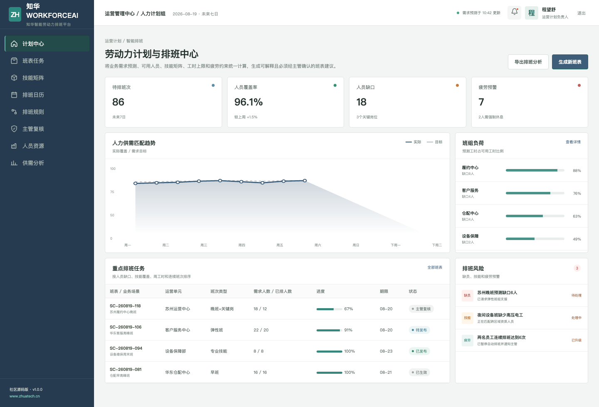
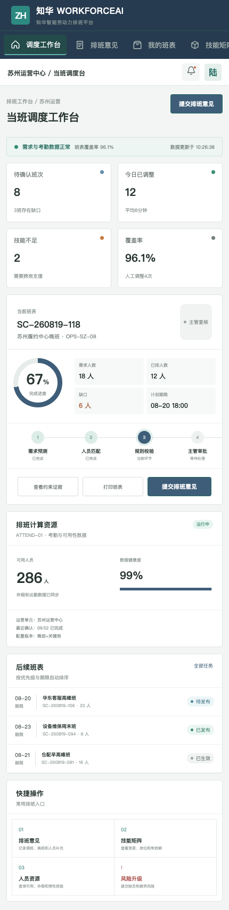

# 知华智能劳动力排班平台（WorkforceAI）

[知华科技官网](https://www.zhuatech.cn/) · 上海如静知华信息科技有限公司 · `cn.zhuatech.workforceai`

WorkforceAI 面向门店、客服、仓储、交付和制造现场，把需求预测、人员可用性、技能矩阵、周工时与连续班次转化为可解释班表建议。



## 从需求到班表

1. 汇总订单、客流、工单或产量，形成未来需求工时。
2. 读取在岗、休假、技能资质和岗位适配信息。
3. 计算需求人数、人员缺口、技能覆盖和疲劳风险。
4. 产生 `PUBLISH / SUPERVISOR_REVIEW / REPLAN` 建议。
5. 由调度员调整、主管审批后发布，员工端确认或申请换班。



### 已包含

- 管理端供需看板、排班任务、技能矩阵、规则、主管复核和分析；
- 移动端班表确认、调班意见、人员资源和风险升级；
- 工时与连续班次门禁、关键岗位资格校验和完整审计记录；
- Java/Vue 前后端分离、MySQL、Docker Compose 与自动化测试。

## 运行

```bash
docker compose up --build
```

访问 `http://localhost:5173`；账号 `admin / Demo@2026`、`operator / Demo@2026`。排班评估接口：`POST /api/ai/workforce/plan`。架构与数据模型见 [docs](docs/architecture.md)。

## 使用限制与合作

本项目仅能用于个人非商业学习交流，**不得商用**。企业内部部署、生产使用、SaaS、客户交付、收费服务、品牌替换或商业发行，必须事先取得上海如静知华信息科技有限公司书面授权，以 [LICENSE](LICENSE) 为准。

需要智能排班、人力数字化、ERP/OA 集成、AI 转型、FDE 与软件项目外包，请联系[知华科技](https://www.zhuatech.cn/)：

| 咨询微信一 | 咨询微信二 |
| --- | --- |
|  |  |

Copyright © 2026 上海如静知华信息科技有限公司
